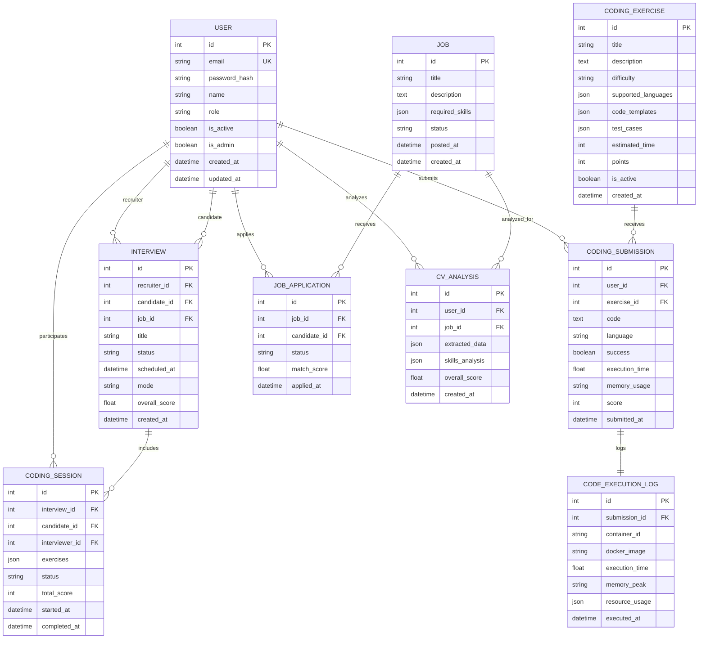

# 📊 Diagramme de Classes - Modèle de Données RecruteIA

## Vue d'ensemble

Ce document présente le modèle de données complet de RecruteIA, incluant la plateforme de coding avec exécution Docker sécurisée.

## 🏗️ Diagramme de Classes UML

## 🏗️ Diagramme Entité-Relation (ERD)

### Vue d'ensemble des entités principales

```
┌─────────────────────────────────────────────────────────────────────────────────┐
│                           RECRUTEAI - MODÈLE DE DONNÉES                         │
└─────────────────────────────────────────────────────────────────────────────────┘

┌─────────────────┐    ┌─────────────────┐    ┌─────────────────┐
│      USER       │    │   INTERVIEW     │    │   CODING        │
│                 │    │                 │    │   PLATFORM      │
│ • id            │◄──►│ • id            │◄──►│                 │
│ • email         │    │ • recruiter_id  │    │ • CodingExercise│
│ • name          │    │ • candidate_id  │    │ • CodingSession │
│ • role          │    │ • status        │    │ • Submission    │
│ • is_admin      │    │ • mode          │    │ • ExecutionLog  │
│ • created_at    │    │ • overall_score │    │                 │
└─────────────────┘    └─────────────────┘    └─────────────────┘
         │                       │                       │
         │                       │                       │
         ▼                       ▼                       ▼
┌─────────────────┐    ┌─────────────────┐    ┌─────────────────┐
│   JOB SYSTEM    │    │   CV ANALYSIS   │    │   MONITORING    │
│                 │    │                 │    │                 │
│ • Job           │    │ • CVAnalysis    │    │ • ActivityLog   │
│ • JobApplication│    │ • extracted_data│    │ • DashboardMetric│
│ • match_score   │    │ • skills_analysis│    │ • Notification  │
│ • status        │    │ • recommendations│    │ • UserSession   │
└─────────────────┘    └─────────────────┘    └─────────────────┘
```

## 📊 Diagramme de Classes Simplifié



## 📋 Description des Entités Principales

### 👤 **Gestion des Utilisateurs**

#### **User**
- **Rôle central** : Gère tous les types d'utilisateurs (admin, recruteur, candidat)
- **Authentification** : Hash des mots de passe, sessions sécurisées
- **Profils** : Informations personnelles et préférences
- **Permissions** : Contrôle d'accès basé sur les rôles

#### **UserSession**
- **Sessions sécurisées** : Tokens JWT avec expiration
- **Audit** : Tracking IP et user-agent
- **Gestion** : Invalidation et rafraîchissement automatique

### 🎯 **Système d'Entretiens**

#### **Interview**
- **Modes multiples** : IA solo, IA assistée, manuel
- **Planification** : Gestion des créneaux et notifications
- **Scoring** : Évaluation automatique et manuelle
- **Enregistrement** : Audio/vidéo avec transcription

#### **InterviewQuestion**
- **Types variés** : Technique, comportementale, situationnelle
- **IA intégrée** : Génération et évaluation automatique
- **Scoring** : Évaluation granulaire par question

### 💼 **Gestion des Emplois**

#### **Job**
- **Matching intelligent** : Algorithme de correspondance compétences
- **Analytics** : Suivi des vues et candidatures
- **Cycle de vie** : Statuts et dates d'expiration

#### **JobApplication**
- **Analyse CV** : Extraction automatique des données
- **Score de match** : Calcul de compatibilité
- **Workflow** : Suivi du processus de candidature

### 🧠 **Analyse CV par IA**

#### **CVAnalysis**
- **Extraction** : OCR et parsing intelligent
- **Analyse** : Compétences, expérience, formation
- **Recommandations** : Suggestions d'amélioration
- **Questions** : Génération automatique pour entretiens

### 💻 **Plateforme de Coding**

#### **CodingExercise**
- **Multi-langages** : Support Python, JS, Java, C++
- **Templates** : Code de démarrage par langage
- **Tests automatisés** : Validation des solutions
- **Métadonnées** : Difficulté, temps estimé, tags

#### **CodingSubmission**
- **Exécution sécurisée** : Conteneurs Docker isolés
- **Métriques** : Temps, mémoire, score
- **Validation** : Tests automatiques et scoring
- **Audit** : Traçabilité complète

#### **CodingSession**
- **Entretiens techniques** : Sessions chronométrées
- **Multi-exercices** : Évaluation complète
- **Temps réel** : Suivi de progression
- **Évaluation** : Score global et détaillé

#### **CodeExecutionLog**
- **Sécurité** : Audit trail complet
- **Performance** : Métriques détaillées
- **Monitoring** : Détection d'anomalies
- **Compliance** : Logs pour audit

### 📊 **Analytics et Dashboard**

#### **DashboardMetric**
- **KPIs** : Métriques clés de performance
- **Tendances** : Analyse temporelle
- **Comparaisons** : Périodes et utilisateurs
- **Insights** : Recommandations automatiques

#### **ActivityLog**
- **Audit** : Toutes les actions utilisateur
- **Sécurité** : Détection d'activités suspectes
- **Analytics** : Patterns d'utilisation
- **Compliance** : Traçabilité réglementaire

## 🔗 Relations Clés

### **Relations Principales**
- `User` ↔ `Interview` (Many-to-Many via rôles)
- `Interview` ↔ `CodingSession` (One-to-One optionnel)
- `CodingExercise` ↔ `CodingSubmission` (One-to-Many)
- `Job` ↔ `JobApplication` ↔ `CVAnalysis` (Chaîne de traitement)

### **Relations de Sécurité**
- `CodingSubmission` ↔ `CodeExecutionLog` (Audit obligatoire)
- `User` ↔ `ActivityLog` (Traçabilité complète)
- `User` ↔ `UserSession` (Sessions multiples)

## 🔒 Considérations de Sécurité

### **Isolation des Données**
- Séparation stricte par utilisateur/entreprise
- Chiffrement des données sensibles
- Audit trail complet

### **Exécution de Code**
- Conteneurs Docker isolés
- Limites de ressources strictes
- Logs de sécurité détaillés

### **Authentification**
- JWT avec expiration
- Sessions révocables
- Audit des connexions

## 📈 Optimisations de Performance

### **Index de Base de Données**
```sql
-- Index critiques pour les performances
CREATE INDEX idx_interviews_recruiter_status ON interviews(recruiter_id, status);
CREATE INDEX idx_coding_submissions_user_exercise ON coding_submissions(user_id, exercise_id);
CREATE INDEX idx_job_applications_status_date ON job_applications(status, applied_at);
CREATE INDEX idx_activity_logs_user_date ON activity_logs(user_id, created_at);
```

### **Partitioning**
- `ActivityLog` : Partitioning par date
- `CodeExecutionLog` : Partitioning par mois
- `DashboardMetric` : Partitioning par période

## 🚀 Évolutivité

### **Architecture Modulaire**
- Séparation claire des responsabilités
- APIs RESTful bien définies
- Microservices ready

### **Extensibilité**
- Nouveaux types d'exercices facilement ajoutables
- Support de nouveaux langages de programmation
- Plugins pour analyses personnalisées

---

**📊 Ce modèle de données offre une base solide et évolutive pour RecruteIA, avec une architecture sécurisée et performante pour la plateforme de coding.**