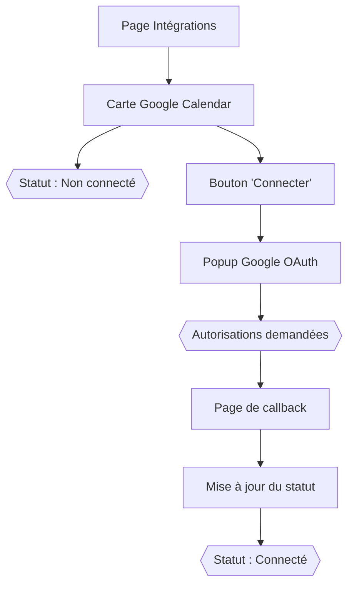

Voici une version détaillée de la **User Story principale** (Connexion à Google Calendar) avec des éléments techniques et tests d'acceptance complets :

---

### **US-01: Connexion à Google Calendar**  
**Épique** : Intégrations Tierces  
**Sprint** : Sprint 2  
**Points** : 5  
**Priorité** : High  

**En tant que** recruteur  
**Je veux** connecter mon compte Google Calendar à l'application  
**Afin de** synchroniser automatiquement mes créneaux d'entretiens  

---

### **Scénarios** (Gherkin/Cucumber)

#### **Scenario 1: Connexion réussie**
```gherkin
Étant donné que je suis sur la page "Intégrations"
Quand je clique sur "Connecter" pour Google Calendar
Et que j'autorise l'accès dans la popup Google
Alors mon statut passe à "Connecté"
Et je vois mes événements dans la section "Calendrier"
```

#### **Scenario 2: Échec d'authentification**
```gherkin
Étant donné que je tente de connecter Google Calendar
Quand je refuse les permissions dans la popup Google
Alors je vois un message "Connexion annulée"
Et l'intégration reste déconnectée
```

---

### **Critères d'Acceptance Techniques**  

| **ID** | **Critère** | **Méthode de Test** |
|--------|------------|---------------------|
| TA-01  | Le bouton déclenche bien un flux OAuth2 avec les scopes `calendar.readonly` | Inspection des requêtes réseau |
| TA-02  | Les tokens sont stockés chiffrés en base (AES-256) | Vérifier la table `user_integrations` |
| TA-03  | Le frontend gère correctement la fermeture de la popup | Test manuel avec `window.close()` |
| TA-04  | Les erreurs Google API (ex: quota dépassé) remontent clairement | Mock API Google avec erreur 403 |

---

### **Spécifications Techniques**  
**1. Endpoints impliqués** :
- `GET /api/integrations/calendar/auth-url` → Génère l'URL OAuth
- `GET /api/integrations/calendar/callback` → Reçoit le code Google
- `GET /api/integrations/calendar/events` → Récupère les événements

**2. Sécurité** :
- Validation du `state` pour éviter les CSRF
- Durée de vie des tokens : 1h (refresh token valide 6 mois)
- Scope minimal : `https://www.googleapis.com/auth/calendar.readonly`

**3. Données stockées** :
```python
# Modèle UserIntegration
{
  "user_id": "123",
  "service": "google_calendar",
  "access_token": "encrypted_value", 
  "refresh_token": "encrypted_value",
  "expires_at": "2023-12-31T23:59:59Z"
}
```

---

### **Maquette UI**  


---

### **Dépendances**  
1. Configuration préalable dans Google Cloud Console :
   - URI de redirection autorisée : `https://votreapp.com/api/integrations/calendar/callback`
   - Activation de l'API Calendar

2. Variables d'environnement requises :
```env
GOOGLE_CLIENT_ID=xxx.apps.googleusercontent.com
GOOGLE_CLIENT_SECRET=xxx
GOOGLE_REDIRECT_URI=https://votreapp.com/api/integrations/calendar/callback
```

---

### **Notes pour les tests**  
1. Cas à tester impérativement :
   - Utilisateur revoque l'accès depuis son compte Google
   - Token expiré avec refresh token valide
   - Connexion depuis différents fuseaux horaires

2. Données de test :
```json
// Événement Google Calendar mocké
{
  "summary": "Entretien avec Jean Dupont",
  "start": {"dateTime": "2023-11-20T14:00:00+01:00"},
  "end": {"dateTime": "2023-11-20T14:45:00+01:00"},
  "attendees": [{"email": "recruteur@example.com"}]
}
```

