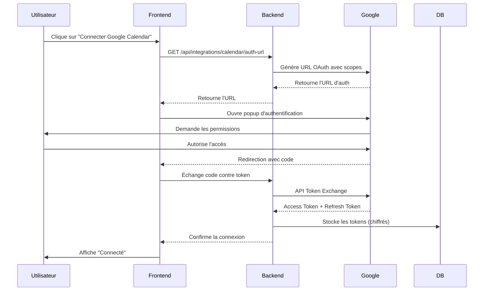

Voici les **User Stories** pour l'intégration Google Calendar implementer

---

### **1. Connexion à Google Calendar**
**En tant que** recruteur/utilisateur  
**Je veux** pouvoir connecter mon compte Google Calendar à l'application  
**Afin de** synchroniser automatiquement mes entretiens et disponibilités  

**Critères d'acceptation** :
- Un bouton "Connecter Google Calendar" est visible dans la section Intégrations
- L'utilisateur est redirigé vers l'authentification Google OAuth
- Après autorisation, l'application reçoit un token d'accès et le stocke de manière sécurisée
- Le statut passe à "Connecté" dans l'UI après succès

---

### **2. Affichage des événements du calendrier**
**En tant que** recruteur  
**Je veux** voir mes événements Google Calendar dans l'application  
**Afin de** éviter les conflits de planning lors de la planification d'entretiens  

**Critères d'acceptation** :
- Les événements sont chargés depuis l'API Google Calendar
- Seuls les événements futurs (max. 10) sont affichés
- Les événements s'affichent dans un format lisible (titre, heure, participants)

---

### **3. Déconnexion de Google Calendar**
**En tant que** utilisateur soucieux de la confidentialité  
**Je veux** pouvoir déconnecter Google Calendar à tout moment  
**Afin de** révoquer les permissions d'accès à mon calendrier  

**Critères d'acceptation** :
- Un bouton "Déconnecter" est disponible dans la section Intégrations
- Le token d'accès est supprimé de la base de données
- L'application n'a plus accès au calendrier après déconnexion

---

### **4. Gestion des erreurs OAuth**
**En tant que** utilisateur  
**Je veux** être informé clairement en cas d'échec de connexion à Google Calendar  
**Afin de** comprendre et résoudre le problème  

**Critères d'acceptance** :
- Les erreurs d'authentification (code invalide, scope refusé) affichent un message clair
- Les logs techniques sont enregistrés côté serveur pour debug
- L'UI propose de réessayer ou contacter le support si besoin

---

### **User Stories Techniques (pour l'équipe dev)**  

### **5. Stockage sécurisé des tokens**
**En tant que** système  
**Je veux** stocker les tokens OAuth de manière chiffrée  
**Afin de** protéger les données utilisateurs en cas de faille de sécurité  

### **6. Rafraîchissement automatique des tokens**
**En tant que** service backend  
**Je veux** rafraîchir automatiquement les tokens expirés  
**Afin de** maintenir la connexion sans interaction utilisateur  

---

### **Diagramme du flux utilisateur**  

